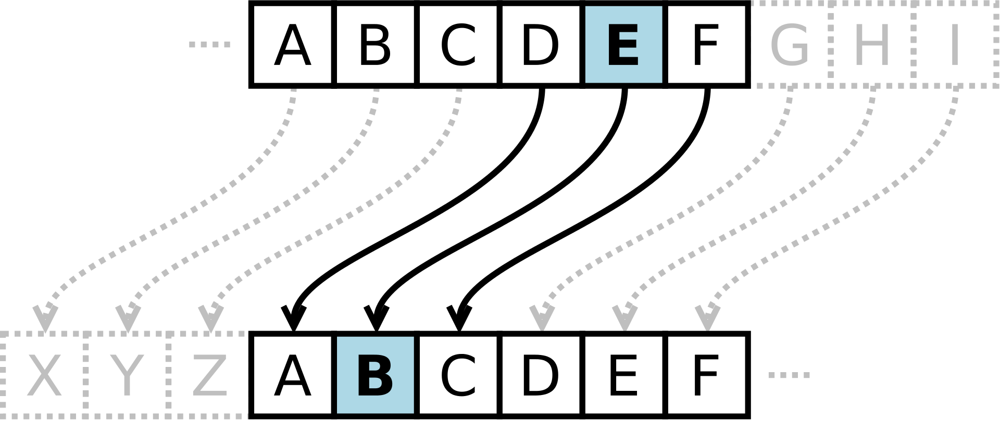

# Caesardle

Guess the shifted word in 8 tries. After each guess, the color of the tiles will
change to show how close your guess was to the word.

The word is encrypted using the <a href="https://en.wikipedia.org/wiki/Caesar_cipher" target="_blank">Caesar cipher</a>. Each letter in the original word is replaced by a letter some fixed number of positions down the alphabet. 
The number of letter positions the word is right-shifted by is a random number between 0 (no shift at all) and 25.

This diagram shows a left shift of 3 letters, or equivalently a right shift of 23 letters. 
For example, if the word was FACED with a right shift of 23, the new solution word would be CXZBA, 
and the color of the tiles will be based on the new word.

The slider at the top denotes the right shift applied to your guesses in the grid. 
For example, guessing the word BLAZE would show the same tile colors as 
guessing AKZYD with a +1 shift, ZJYXC with a +2 shift, and so on.
Moving the slider helps you focus on or rule out potential shift values for the solution word. 
The colors on the keyboard will reflect the tile colors of the current shift value. 
<strong>Your guess must be a valid word in at least one shift value.</strong>

[**Play the daily game here!**](https://caesardle.netlify.app)

This is one of the Wordle variants I have made. The other games and instructions for creating your own Wordle variant can be found [here](https://github.com/Compsciler/Wordle-With-Score-Database/).
